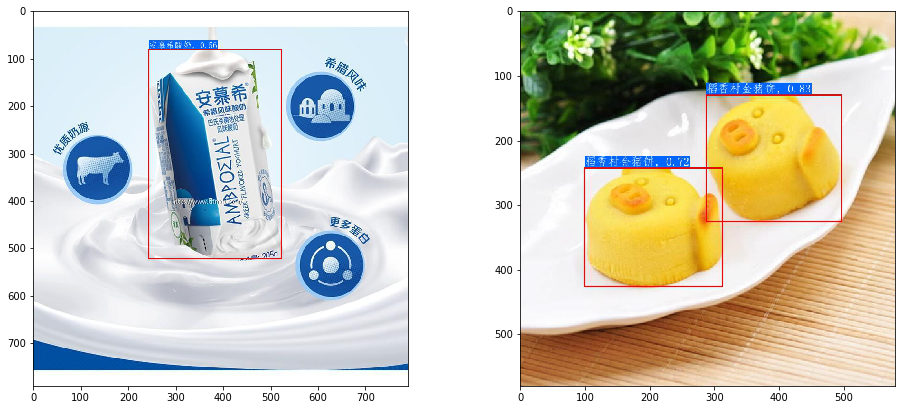
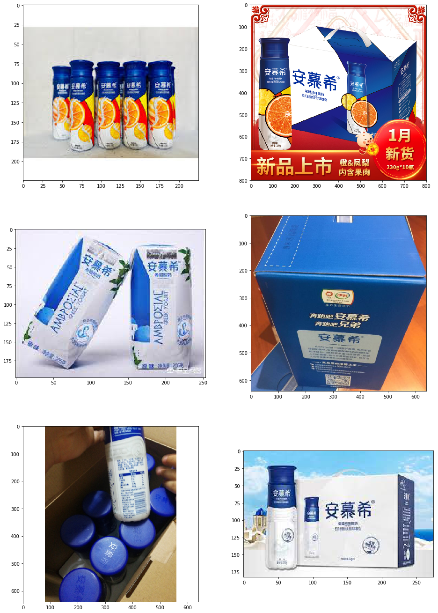

# 图像快速识别

# 项目背景
主要针对样本量少、类别多、新类别增加比较快，不想重训模型这样的情况，用检索的方式去做识别会有很大的优势。
当索引库中的图像无法覆盖我们实际识别的场景时，即在预测未知类别的图像时，我们需要将对应类别的相似图像添加到索引库中，从而完成对未知类别的图像识别，这一过程是不需要重新训练的。
整个图像识别系统分为三步：（1）通过一个目标检测模型，检测图像物体候选区域（2）对每个候选区域进行特征提取（3）与检索库中图像进行特征匹配，提取识别结果。

对于新的未知类别，无需重新训练模型，只需要在检索库补入该类别图像，重新建立检索库，就可以识别该类别。

# 预训练模型和数据集简介
官方提供的识别inference模型、测试数据包括Logo、动漫人物、车辆、商品4个方向。
检测模型与4个方向(Logo、动漫人物、车辆、商品)的识别inference模型、测试数据下载地址以及对应的配置文件地址如下。

| 模型简介       | 推荐场景   | inference模型  | 预测配置文件  | 构建索引库的配置文件 |
| ------------  | ------------- | -------- | ------- | -------- |
| 通用主体检测模型 | 通用场景  |[模型下载链接](https://paddle-imagenet-models-name.bj.bcebos.com/dygraph/rec/models/inference/ppyolov2_r50vd_dcn_mainbody_v1.0_infer.tar) | - | - |
| Logo识别模型 | Logo场景  | [模型下载链接](https://paddle-imagenet-models-name.bj.bcebos.com/dygraph/rec/models/inference/logo_rec_ResNet50_Logo3K_v1.0_infer.tar) | [inference_logo.yaml](../../../deploy/configs/inference_logo.yaml) | [build_logo.yaml](../../../deploy/configs/build_logo.yaml) |
| 动漫人物识别模型 | 动漫人物场景  | [模型下载链接](https://paddle-imagenet-models-name.bj.bcebos.com/dygraph/rec/models/inference/cartoon_rec_ResNet50_iCartoon_v1.0_infer.tar) | [inference_cartoon.yaml](../../../deploy/configs/inference_cartoon.yaml) | [build_cartoon.yaml](../../../deploy/configs/build_cartoon.yaml) |
| 车辆细分类模型 | 车辆场景  |  [模型下载链接](https://paddle-imagenet-models-name.bj.bcebos.com/dygraph/rec/models/inference/vehicle_cls_ResNet50_CompCars_v1.0_infer.tar) | [inference_vehicle.yaml](../../../deploy/configs/inference_vehicle.yaml) | [build_vehicle.yaml](../../../deploy/configs/build_vehicle.yaml) |
| 商品识别模型 | 商品场景  |  [模型下载链接](https://paddle-imagenet-models-name.bj.bcebos.com/dygraph/rec/models/inference/product_ResNet50_vd_aliproduct_v1.0_infer.tar) | [inference_product.yaml](../../../deploy/configs/inference_product.yaml) | [build_product.yaml](../../../deploy/configs/build_product.yaml) |
| 车辆ReID模型 | 车辆ReID场景 | [模型下载链接](https://paddle-imagenet-models-name.bj.bcebos.com/dygraph/rec/models/inference/vehicle_reid_ResNet50_VERI_Wild_v1.0_infer.tar) | - | - |


demo数据下载地址如下: [数据下载链接](https://paddle-imagenet-models-name.bj.bcebos.com/dygraph/rec/data/recognition_demo_data_v1.0.tar)。

# 环境配置
安装paddleclas套件并下载相关预训练模型。


```python
# 克隆PaddleClas模型库
# !git clone https://github.com/PaddlePaddle/PaddleClas.git -b release/2.2
# 如果从github上网速太慢，可以从gitee下载，下载命令如下：
!git clone https://gitee.com/paddlepaddle/PaddleClas.git -b release/2.2
```

    Cloning into 'PaddleClas'...
    remote: Enumerating objects: 538, done.
    remote: Counting objects: 100% (538/538), done.
    remote: Compressing objects: 100% (323/323), done.
    remote: Total 15290 (delta 347), reused 349 (delta 210), pack-reused 14752
    Receiving objects: 100% (15290/15290), 113.56 MiB | 14.73 MiB/s, done.
    Resolving deltas: 100% (10239/10239), done.
    Checking connectivity... done.


```python
# 安装Python依赖库
%cd PaddleClas/
# !pip install --upgrade -r requirements.txt -i https://mirror.baidu.com/pypi/simple 百度源不好用
!pip install -r requirements.txt
```

    /home/aistudio/PaddleClas
    Looking in indexes: https://mirror.baidu.com/pypi/simple/
    Requirement already satisfied: prettytable in /opt/conda/envs/python35-paddle120-env/lib/python3.7/site-packages (from -r requirements.txt (line 1)) (0.7.2)
    Requirement already satisfied: ujson in /opt/conda/envs/python35-paddle120-env/lib/python3.7/site-packages (from -r requirements.txt (line 2)) (1.35)
    Collecting opencv-python==3.4.9.31 (from -r requirements.txt (line 3))
    [?25l  Downloading https://mirror.baidu.com/pypi/packages/bb/3e/b70f639bbd9e463dc781d7b3b5f9102ebe3ea658682825d99948083d50fd/opencv_python-3.4.9.31-cp37-cp37m-manylinux1_x86_64.whl (28.2MB)
         |████████████████████████████████| 28.2MB 8.7MB/s eta 0:00:012
    [?25hRequirement already satisfied: pillow in /opt/conda/envs/python35-paddle120-env/lib/python3.7/site-packages (from -r requirements.txt (line 4)) (7.1.2)
    Requirement already satisfied: tqdm in /opt/conda/envs/python35-paddle120-env/lib/python3.7/site-packages (from -r requirements.txt (line 5)) (4.36.1)
    Requirement already satisfied: PyYAML in /opt/conda/envs/python35-paddle120-env/lib/python3.7/site-packages (from -r requirements.txt (line 6)) (5.1.2)
    Requirement already satisfied: visualdl>=2.0.0b in /opt/conda/envs/python35-paddle120-env/lib/python3.7/site-packages (from -r requirements.txt (line 7)) (2.2.0)
    Requirement already satisfied: scipy in /opt/conda/envs/python35-paddle120-env/lib/python3.7/site-packages (from -r requirements.txt (line 8)) (1.6.3)
    Collecting scikit-learn==0.23.2 (from -r requirements.txt (line 9))
    [?25l  Downloading https://mirror.baidu.com/pypi/packages/f4/cb/64623369f348e9bfb29ff898a57ac7c91ed4921f228e9726546614d63ccb/scikit_learn-0.23.2-cp37-cp37m-manylinux1_x86_64.whl (6.8MB)
         |████████████████████████████████| 6.8MB 14.0MB/s eta 0:00:01     |███████████████████████████████ | 6.6MB 14.0MB/s eta 0:00:01
    [?25hRequirement already satisfied: gast==0.3.3 in /opt/conda/envs/python35-paddle120-env/lib/python3.7/site-packages (from -r requirements.txt (line 10)) (0.3.3)
    Requirement already satisfied: numpy>=1.14.5 in /opt/conda/envs/python35-paddle120-env/lib/python3.7/site-packages (from opencv-python==3.4.9.31->-r requirements.txt (line 3)) (1.20.3)
    Requirement already satisfied: pandas in /opt/conda/envs/python35-paddle120-env/lib/python3.7/site-packages (from visualdl>=2.0.0b->-r requirements.txt (line 7)) (1.1.5)
    Requirement already satisfied: flake8>=3.7.9 in /opt/conda/envs/python35-paddle120-env/lib/python3.7/site-packages (from visualdl>=2.0.0b->-r requirements.txt (line 7)) (3.8.2)
    Requirement already satisfied: six>=1.14.0 in /opt/conda/envs/python35-paddle120-env/lib/python3.7/site-packages (from visualdl>=2.0.0b->-r requirements.txt (line 7)) (1.15.0)
    Requirement already satisfied: bce-python-sdk in /opt/conda/envs/python35-paddle120-env/lib/python3.7/site-packages (from visualdl>=2.0.0b->-r requirements.txt (line 7)) (0.8.53)
    Requirement already satisfied: pre-commit in /opt/conda/envs/python35-paddle120-env/lib/python3.7/site-packages (from visualdl>=2.0.0b->-r requirements.txt (line 7)) (1.21.0)
    Requirement already satisfied: protobuf>=3.11.0 in /opt/conda/envs/python35-paddle120-env/lib/python3.7/site-packages (from visualdl>=2.0.0b->-r requirements.txt (line 7)) (3.14.0)
    Requirement already satisfied: shellcheck-py in /opt/conda/envs/python35-paddle120-env/lib/python3.7/site-packages (from visualdl>=2.0.0b->-r requirements.txt (line 7)) (0.7.1.1)
    Requirement already satisfied: requests in /opt/conda/envs/python35-paddle120-env/lib/python3.7/site-packages (from visualdl>=2.0.0b->-r requirements.txt (line 7)) (2.22.0)
    Requirement already satisfied: flask>=1.1.1 in /opt/conda/envs/python35-paddle120-env/lib/python3.7/site-packages (from visualdl>=2.0.0b->-r requirements.txt (line 7)) (1.1.1)
    Requirement already satisfied: Flask-Babel>=1.0.0 in /opt/conda/envs/python35-paddle120-env/lib/python3.7/site-packages (from visualdl>=2.0.0b->-r requirements.txt (line 7)) (1.0.0)
    Requirement already satisfied: matplotlib in /opt/conda/envs/python35-paddle120-env/lib/python3.7/site-packages (from visualdl>=2.0.0b->-r requirements.txt (line 7)) (2.2.3)
    Requirement already satisfied: threadpoolctl>=2.0.0 in /opt/conda/envs/python35-paddle120-env/lib/python3.7/site-packages (from scikit-learn==0.23.2->-r requirements.txt (line 9)) (2.1.0)
    Requirement already satisfied: joblib>=0.11 in /opt/conda/envs/python35-paddle120-env/lib/python3.7/site-packages (from scikit-learn==0.23.2->-r requirements.txt (line 9)) (0.14.1)
    Requirement already satisfied: python-dateutil>=2.7.3 in /opt/conda/envs/python35-paddle120-env/lib/python3.7/site-packages (from pandas->visualdl>=2.0.0b->-r requirements.txt (line 7)) (2.8.0)
    Requirement already satisfied: pytz>=2017.2 in /opt/conda/envs/python35-paddle120-env/lib/python3.7/site-packages (from pandas->visualdl>=2.0.0b->-r requirements.txt (line 7)) (2019.3)
    Requirement already satisfied: mccabe<0.7.0,>=0.6.0 in /opt/conda/envs/python35-paddle120-env/lib/python3.7/site-packages (from flake8>=3.7.9->visualdl>=2.0.0b->-r requirements.txt (line 7)) (0.6.1)
    Requirement already satisfied: pycodestyle<2.7.0,>=2.6.0a1 in /opt/conda/envs/python35-paddle120-env/lib/python3.7/site-packages (from flake8>=3.7.9->visualdl>=2.0.0b->-r requirements.txt (line 7)) (2.6.0)
    Requirement already satisfied: importlib-metadata; python_version < "3.8" in /opt/conda/envs/python35-paddle120-env/lib/python3.7/site-packages (from flake8>=3.7.9->visualdl>=2.0.0b->-r requirements.txt (line 7)) (0.23)
    Requirement already satisfied: pyflakes<2.3.0,>=2.2.0 in /opt/conda/envs/python35-paddle120-env/lib/python3.7/site-packages (from flake8>=3.7.9->visualdl>=2.0.0b->-r requirements.txt (line 7)) (2.2.0)
    Requirement already satisfied: pycryptodome>=3.8.0 in /opt/conda/envs/python35-paddle120-env/lib/python3.7/site-packages (from bce-python-sdk->visualdl>=2.0.0b->-r requirements.txt (line 7)) (3.9.9)
    Requirement already satisfied: future>=0.6.0 in /opt/conda/envs/python35-paddle120-env/lib/python3.7/site-packages (from bce-python-sdk->visualdl>=2.0.0b->-r requirements.txt (line 7)) (0.18.0)
    Requirement already satisfied: nodeenv>=0.11.1 in /opt/conda/envs/python35-paddle120-env/lib/python3.7/site-packages (from pre-commit->visualdl>=2.0.0b->-r requirements.txt (line 7)) (1.3.4)
    Requirement already satisfied: toml in /opt/conda/envs/python35-paddle120-env/lib/python3.7/site-packages (from pre-commit->visualdl>=2.0.0b->-r requirements.txt (line 7)) (0.10.0)
    Requirement already satisfied: virtualenv>=15.2 in /opt/conda/envs/python35-paddle120-env/lib/python3.7/site-packages (from pre-commit->visualdl>=2.0.0b->-r requirements.txt (line 7)) (16.7.9)
    Requirement already satisfied: cfgv>=2.0.0 in /opt/conda/envs/python35-paddle120-env/lib/python3.7/site-packages (from pre-commit->visualdl>=2.0.0b->-r requirements.txt (line 7)) (2.0.1)
    Requirement already satisfied: aspy.yaml in /opt/conda/envs/python35-paddle120-env/lib/python3.7/site-packages (from pre-commit->visualdl>=2.0.0b->-r requirements.txt (line 7)) (1.3.0)
    Requirement already satisfied: identify>=1.0.0 in /opt/conda/envs/python35-paddle120-env/lib/python3.7/site-packages (from pre-commit->visualdl>=2.0.0b->-r requirements.txt (line 7)) (1.4.10)
    Requirement already satisfied: chardet<3.1.0,>=3.0.2 in /opt/conda/envs/python35-paddle120-env/lib/python3.7/site-packages (from requests->visualdl>=2.0.0b->-r requirements.txt (line 7)) (3.0.4)
    Requirement already satisfied: certifi>=2017.4.17 in /opt/conda/envs/python35-paddle120-env/lib/python3.7/site-packages (from requests->visualdl>=2.0.0b->-r requirements.txt (line 7)) (2019.9.11)
    Requirement already satisfied: urllib3!=1.25.0,!=1.25.1,<1.26,>=1.21.1 in /opt/conda/envs/python35-paddle120-env/lib/python3.7/site-packages (from requests->visualdl>=2.0.0b->-r requirements.txt (line 7)) (1.25.6)
    Requirement already satisfied: idna<2.9,>=2.5 in /opt/conda/envs/python35-paddle120-env/lib/python3.7/site-packages (from requests->visualdl>=2.0.0b->-r requirements.txt (line 7)) (2.8)
    Requirement already satisfied: itsdangerous>=0.24 in /opt/conda/envs/python35-paddle120-env/lib/python3.7/site-packages (from flask>=1.1.1->visualdl>=2.0.0b->-r requirements.txt (line 7)) (1.1.0)
    Requirement already satisfied: Werkzeug>=0.15 in /opt/conda/envs/python35-paddle120-env/lib/python3.7/site-packages (from flask>=1.1.1->visualdl>=2.0.0b->-r requirements.txt (line 7)) (0.16.0)
    Requirement already satisfied: click>=5.1 in /opt/conda/envs/python35-paddle120-env/lib/python3.7/site-packages (from flask>=1.1.1->visualdl>=2.0.0b->-r requirements.txt (line 7)) (7.0)
    Requirement already satisfied: Jinja2>=2.10.1 in /opt/conda/envs/python35-paddle120-env/lib/python3.7/site-packages (from flask>=1.1.1->visualdl>=2.0.0b->-r requirements.txt (line 7)) (2.10.1)
    Requirement already satisfied: Babel>=2.3 in /opt/conda/envs/python35-paddle120-env/lib/python3.7/site-packages (from Flask-Babel>=1.0.0->visualdl>=2.0.0b->-r requirements.txt (line 7)) (2.8.0)
    Requirement already satisfied: cycler>=0.10 in /opt/conda/envs/python35-paddle120-env/lib/python3.7/site-packages (from matplotlib->visualdl>=2.0.0b->-r requirements.txt (line 7)) (0.10.0)
    Requirement already satisfied: pyparsing!=2.0.4,!=2.1.2,!=2.1.6,>=2.0.1 in /opt/conda/envs/python35-paddle120-env/lib/python3.7/site-packages (from matplotlib->visualdl>=2.0.0b->-r requirements.txt (line 7)) (2.4.2)
    Requirement already satisfied: kiwisolver>=1.0.1 in /opt/conda/envs/python35-paddle120-env/lib/python3.7/site-packages (from matplotlib->visualdl>=2.0.0b->-r requirements.txt (line 7)) (1.1.0)
    Requirement already satisfied: zipp>=0.5 in /opt/conda/envs/python35-paddle120-env/lib/python3.7/site-packages (from importlib-metadata; python_version < "3.8"->flake8>=3.7.9->visualdl>=2.0.0b->-r requirements.txt (line 7)) (0.6.0)
    Requirement already satisfied: MarkupSafe>=0.23 in /opt/conda/envs/python35-paddle120-env/lib/python3.7/site-packages (from Jinja2>=2.10.1->flask>=1.1.1->visualdl>=2.0.0b->-r requirements.txt (line 7)) (1.1.1)
    Requirement already satisfied: setuptools in /opt/conda/envs/python35-paddle120-env/lib/python3.7/site-packages (from kiwisolver>=1.0.1->matplotlib->visualdl>=2.0.0b->-r requirements.txt (line 7)) (56.2.0)
    Requirement already satisfied: more-itertools in /opt/conda/envs/python35-paddle120-env/lib/python3.7/site-packages (from zipp>=0.5->importlib-metadata; python_version < "3.8"->flake8>=3.7.9->visualdl>=2.0.0b->-r requirements.txt (line 7)) (7.2.0)
    ERROR: blackhole 1.0.1 has requirement numpy<=1.19.5, but you'll have numpy 1.20.3 which is incompatible.
    Installing collected packages: opencv-python, scikit-learn
      Found existing installation: opencv-python 4.1.1.26
        Uninstalling opencv-python-4.1.1.26:
          Successfully uninstalled opencv-python-4.1.1.26
      Found existing installation: scikit-learn 0.24.2
        Uninstalling scikit-learn-0.24.2:
          Successfully uninstalled scikit-learn-0.24.2
    Successfully installed opencv-python-3.4.9.31 scikit-learn-0.23.2


```python
pwd
```


```python
%cd ./PaddleClas/deploy
!mkdir models
%cd models
# 下载通用检测inference模型并解压
!wget https://paddle-imagenet-models-name.bj.bcebos.com/dygraph/rec/models/inference/ppyolov2_r50vd_dcn_mainbody_v1.0_infer.tar && tar -xf ppyolov2_r50vd_dcn_mainbody_v1.0_infer.tar
# 下载识别inference模型并解压
!wget https://paddle-imagenet-models-name.bj.bcebos.com/dygraph/rec/models/inference/product_ResNet50_vd_aliproduct_v1.0_infer.tar && tar -xf product_ResNet50_vd_aliproduct_v1.0_infer.tar
```

    /home/aistudio/PaddleClas/deploy/models
    --2021-08-12 19:31:10--  https://paddle-imagenet-models-name.bj.bcebos.com/dygraph/rec/models/inference/ppyolov2_r50vd_dcn_mainbody_v1.0_infer.tar
    Resolving paddle-imagenet-models-name.bj.bcebos.com (paddle-imagenet-models-name.bj.bcebos.com)... 182.61.200.195, 182.61.200.229, 2409:8c04:1001:1002:0:ff:b001:368a, ...
    Connecting to paddle-imagenet-models-name.bj.bcebos.com (paddle-imagenet-models-name.bj.bcebos.com)|182.61.200.195|:443... connected.
    HTTP request sent, awaiting response... 200 OK
    Length: 202122993 (193M) [application/x-tar]
    Saving to: ‘ppyolov2_r50vd_dcn_mainbody_v1.0_infer.tar’
    
    ppyolov2_r50vd_dcn_ 100%[===================>] 192.76M  70.0MB/s    in 2.8s    
    
    2021-08-12 19:31:12 (70.0 MB/s) - ‘ppyolov2_r50vd_dcn_mainbody_v1.0_infer.tar’ saved [202122993/202122993]
    
    --2021-08-12 19:31:15--  https://paddle-imagenet-models-name.bj.bcebos.com/dygraph/rec/models/inference/product_ResNet50_vd_aliproduct_v1.0_infer.tar
    Resolving paddle-imagenet-models-name.bj.bcebos.com (paddle-imagenet-models-name.bj.bcebos.com)... 182.61.200.195, 182.61.200.229, 2409:8c00:6c21:10ad:0:ff:b00e:67d, ...
    Connecting to paddle-imagenet-models-name.bj.bcebos.com (paddle-imagenet-models-name.bj.bcebos.com)|182.61.200.195|:443... connected.
    HTTP request sent, awaiting response... 200 OK
    Length: 91524616 (87M) [application/x-tar]
    Saving to: ‘product_ResNet50_vd_aliproduct_v1.0_infer.tar’
    
    product_ResNet50_vd 100%[===================>]  87.28M  31.2MB/s    in 2.8s    
    
    2021-08-12 19:31:17 (31.2 MB/s) - ‘product_ResNet50_vd_aliproduct_v1.0_infer.tar’ saved [91524616/91524616]
    
    --2021-08-12 19:31:19--  https://paddle-imagenet-models-name.bj.bcebos.com/dygraph/rec/data/recognition_demo_data_v1.0.tar
    Resolving paddle-imagenet-models-name.bj.bcebos.com (paddle-imagenet-models-name.bj.bcebos.com)... 182.61.200.195, 182.61.200.229, 2409:8c04:1001:1002:0:ff:b001:368a, ...
    Connecting to paddle-imagenet-models-name.bj.bcebos.com (paddle-imagenet-models-name.bj.bcebos.com)|182.61.200.195|:443... connected.
    HTTP request sent, awaiting response... 200 OK
    Length: 30288352 (29M) [application/x-tar]
    Saving to: ‘recognition_demo_data_v1.0.tar’
    
    recognition_demo_da 100%[===================>]  28.88M  38.8MB/s    in 0.7s    
    
    2021-08-12 19:31:20 (38.8 MB/s) - ‘recognition_demo_data_v1.0.tar’ saved [30288352/30288352]
    


# 已知图像的快速识别
以商品识别为例，展示识别与检索过程（如果希望尝试其他方向的识别与检索效果，在下载解压好对应的demo数据与模型之后，替换对应的配置文件即可完成预测）。


```python
%cd /home/aistudio/PaddleClas/deploy
```

    /home/aistudio/PaddleClas/deploy


```python
# 下载demo数据并解压
! wget https://paddle-imagenet-models-name.bj.bcebos.com/dygraph/rec/data/recognition_demo_data_v1.0.tar && tar -xf recognition_demo_data_v1.0.tar
```

    --2021-08-12 20:06:21--  https://paddle-imagenet-models-name.bj.bcebos.com/dygraph/rec/data/recognition_demo_data_v1.0.tar
    Resolving paddle-imagenet-models-name.bj.bcebos.com (paddle-imagenet-models-name.bj.bcebos.com)... 182.61.200.229, 182.61.200.195, 2409:8c04:1001:1002:0:ff:b001:368a, ...
    Connecting to paddle-imagenet-models-name.bj.bcebos.com (paddle-imagenet-models-name.bj.bcebos.com)|182.61.200.229|:443... connected.
    HTTP request sent, awaiting response... 200 OK
    Length: 30288352 (29M) [application/x-tar]
    Saving to: ‘recognition_demo_data_v1.0.tar’
    
    recognition_demo_da 100%[===================>]  28.88M  40.3MB/s    in 0.7s    
    
    2021-08-12 20:06:22 (40.3 MB/s) - ‘recognition_demo_data_v1.0.tar’ saved [30288352/30288352]
    


```python
# 解压完毕后，`recognition_demo_data_v1.0`文件夹下应有如下文件结构：其中`gallery_xxx`文件夹中存放的是用于构建索引库的原始图像，`test_xxx`文件夹中存放的是用于测试识别效果的图像列表。
!tree recognition_demo_data_v1.0
```

    recognition_demo_data_v1.0
    ├── gallery_cartoon
    │   ├── data_file.txt
    │   ├── gallery
    │   │   ├── aisidesi-004.png
    │   │   ├── aisidesi-007.jpeg
    │   │   ├── aisidesi-008.jpeg
    │   │   ├── labixiaoxin-001.jpeg
    │   │   ├── labixiaoxin-005.jpeg
    │   │   ├── labixiaoxin-007.jpeg
    │   │   ├── liuchuanfeng-001.jpeg
    │   │   ├── liuchuanfeng-009.jpeg
    │   │   ├── mickeymouse-001.jpeg
    │   │   ├── mickeymouse-002.jpeg
    │   │   ├── mickeymouse-005.jpeg
    │   │   ├── mingren-002.jpeg
    │   │   ├── mingren-008.jpeg
    │   │   ├── mingren-009.jpeg
    │   │   ├── qilongzhu-wukong-003.jpeg
    │   │   ├── qilongzhu-wukong-005.jpeg
    │   │   ├── qilongzhu-wukong-006.jpeg
    │   │   ├── zhangchulan-002.jpeg
    │   │   ├── zhangchulan-003.jpeg
    │   │   └── zhangchulan-006.jpeg
    │   └── index
    │       ├── index.data
    │       ├── index.graph
    │       └── info.json
    ├── gallery_logo
    │   ├── data_file.txt
    │   ├── gallery
    │   │   ├── benz-001.jpeg
    │   │   ├── benz-003.jpeg
    │   │   ├── benz-011.png
    │   │   ├── bmw-001.jpeg
    │   │   ├── bmw-002.jpeg
    │   │   ├── bmw-003.jpeg
    │   │   ├── cctv_1.jpeg
    │   │   ├── cctv_2.jpeg
    │   │   ├── cctv_3.jpeg
    │   │   ├── mangguo_1.jpeg
    │   │   ├── mangguo_2.jpeg
    │   │   ├── mangguo_3.jpeg
    │   │   ├── wangzai-001.png
    │   │   ├── wangzai-002.png
    │   │   ├── wangzai-004.png
    │   │   ├── zhongshiyou-001.jpeg
    │   │   ├── zhongshiyou-002.jpeg
    │   │   └── zhongshiyou-004.jpeg
    │   └── index
    │       ├── index.data
    │       ├── index.graph
    │       └── info.json
    ├── gallery_product
    │   ├── data_file.txt
    │   ├── data_file_update.txt
    │   ├── gallery
    │   │   ├── anmuxi
    │   │   │   ├── 001.jpg
    │   │   │   ├── 002.jpg
    │   │   │   ├── 003.jpg
    │   │   │   ├── 004.jpg
    │   │   │   ├── 005.jpg
    │   │   │   └── 006.jpg
    │   │   ├── channelhandle_1.jpg
    │   │   ├── channelhandle_7.jpg
    │   │   ├── channelhandle_9.jpg
    │   │   ├── channelhandle_ex1.jpg
    │   │   ├── channelhandle_ex2.jpeg
    │   │   ├── channelhandle_ex3.jpeg
    │   │   ├── channelhandle_ex4.jpg
    │   │   ├── cliniqueblush_1.jpg
    │   │   ├── cliniqueblush_2.jpg
    │   │   ├── cliniqueblush_7.jpg
    │   │   ├── daoxiangcunjinzhubing_1.jpg
    │   │   ├── daoxiangcunjinzhubing_2.jpg
    │   │   ├── daoxiangcunjinzhubing_9.jpg
    │   │   ├── gannidress_01.jpg
    │   │   ├── gannidress_05.jpg
    │   │   ├── gannidress_09.jpg
    │   │   ├── gannilianyiqun_01.jpg
    │   │   ├── gannilianyiqun_02.jpg
    │   │   ├── gannilianyiqun_04.jpg
    │   │   ├── gbyingerche_3.png
    │   │   ├── gbyingerche_4.png
    │   │   ├── gbyingerche_6.jpg
    │   │   ├── iphone12pro_6.jpg
    │   │   ├── iphone12pro_7.jpg
    │   │   ├── iphone12pro_8.jpg
    │   │   ├── iphone12pro_ex1.jpeg
    │   │   ├── iphone12pro_ex2.jpeg
    │   │   ├── lafiolewine_02.jpg
    │   │   ├── lafiolewine_03.jpg
    │   │   ├── lafiolewine_06.jpg
    │   │   ├── legaoaishao_3.jpg
    │   │   ├── legaoaishao_5.jpg
    │   │   ├── legaoaishao_8.jpg
    │   │   ├── lvnano_2.jpg
    │   │   ├── lvnano_5.jpg
    │   │   ├── lvnano_8.jpg
    │   │   ├── lvnano_9.jpg
    │   │   ├── macpro_13.jpg
    │   │   ├── macpro_15.jpg
    │   │   ├── macpro_1.png
    │   │   ├── macpro_2.png
    │   │   ├── macpro_8.jpg
    │   │   ├── pulipulai_4.jpg
    │   │   ├── pulipulai_7.jpg
    │   │   ├── pulipulai_8.jpg
    │   │   ├── quanyoushafa_1.jpg
    │   │   ├── quanyoushafa_3.jpg
    │   │   ├── quanyoushafa_6.jpg
    │   │   ├── taochunqiu_2.jpg
    │   │   ├── taochunqiu_3.jpg
    │   │   ├── taochunqiu_5.jpg
    │   │   ├── tfeyeshadow_101.jpg
    │   │   ├── tfeyeshadow_102.jpg
    │   │   ├── tfeyeshadow_103.jpg
    │   │   ├── tfeyeshadow_104.jpg
    │   │   ├── tfeyeshadow_105.jpg
    │   │   ├── tfeyeshadow_10.jpg
    │   │   ├── tfeyeshadow_1.jpg
    │   │   ├── tfeyeshadow_2.jpg
    │   │   ├── tfeyeshadow_5.jpg
    │   │   ├── tfeyeshadow_7.jpg
    │   │   ├── tfeyeshadow_9.jpg
    │   │   ├── thinkpad_s2_1.jpg
    │   │   ├── thinkpad_s2_4.jpg
    │   │   ├── thinkpad_s2_5.jpg
    │   │   ├── weiduomeinaiyougege_1.jpg
    │   │   ├── weiduomeinaiyougege_2.jpg
    │   │   ├── weiduomeinaiyougege_4.jpg
    │   │   ├── weiduomeinaiyougege_7.jpg
    │   │   ├── xiyangshen_11.jpg
    │   │   ├── xiyangshen_3.jpg
    │   │   ├── xiyangshen_6.jpg
    │   │   ├── yunlingicewine_02.jpg
    │   │   ├── yunlingicewine_03.jpg
    │   │   ├── yunlingicewine_05.jpg
    │   │   ├── yunmuerlianyiqun_4.jpg
    │   │   ├── yunmuerlianyiqun_5.jpg
    │   │   ├── yunmuerlianyiqun_7.jpg
    │   │   └── yunmuerlianyiqun_8.jpg
    │   ├── index
    │   │   ├── index.data
    │   │   ├── index.graph
    │   │   └── info.json
    │   └── index_update
    │       ├── index.data
    │       ├── index.graph
    │       └── info.json
    ├── gallery_vehicle
    │   ├── data_file.txt
    │   ├── gallery
    │   │   ├── audia4-103.jpeg
    │   │   ├── audia4-107.jpeg
    │   │   ├── audia4-109.jpeg
    │   │   ├── audia5-114.jpeg
    │   │   ├── audia5-115.jpeg
    │   │   ├── audia5-118.jpeg
    │   │   ├── bentian-yage-107.jpeg
    │   │   ├── bentian-yage-108.jpeg
    │   │   ├── bentian-yage-109.jpeg
    │   │   ├── bmw-m340-102.jpeg
    │   │   ├── bmw-m340-104.jpeg
    │   │   ├── bmw-m340-105.jpeg
    │   │   ├── porsche-cayenne-101.jpeg
    │   │   ├── porsche-cayenne-107.jpeg
    │   │   └── porsche-cayenne-109.jpeg
    │   └── index
    │       ├── index.data
    │       ├── index.graph
    │       └── info.json
    ├── test_cartoon
    │   ├── aisidesi-001.jpeg
    │   ├── aisidesi-005.jpeg
    │   ├── aisidesi-007.jpeg
    │   ├── aisidesi-008.jpeg
    │   ├── labixiaoxin-004.jpeg
    │   ├── labixiaoxin-005.jpeg
    │   ├── labixiaoxin-006.jpeg
    │   ├── labixiaoxin-007.jpeg
    │   ├── labixiaoxin-008.jpeg
    │   ├── labixiaoxin-009.png
    │   ├── labixiaoxin-010.jpeg
    │   ├── liuchuanfeng-001.jpeg
    │   ├── liuchuanfeng-009.jpeg
    │   ├── liuchuanfeng-010.jpeg
    │   ├── mickeymouse-003.jpeg
    │   ├── mickeymouse-005.jpeg
    │   ├── mingren-005.jpeg
    │   ├── mingren-008.jpeg
    │   ├── mingren-009.jpeg
    │   ├── qilongzhu-wukong-004.jpeg
    │   ├── qilongzhu-wukong-007.jpeg
    │   ├── qilongzhu-wukong-008.jpeg
    │   ├── qilongzhu-wukong-010.jpeg
    │   ├── zhangchulan-001.jpeg
    │   ├── zhangchulan-002.jpeg
    │   ├── zhangchulan-004.jpeg
    │   ├── zhangchulan-005.jpeg
    │   ├── zhangchulan-007.jpeg
    │   └── zhangchulan-008.jpeg
    ├── test_logo
    │   ├── benz-001.jpeg
    │   ├── benz-003.jpeg
    │   ├── benz-008.jpeg
    │   ├── benz-009.jpeg
    │   ├── benz-010.jpeg
    │   ├── benz-011.jpeg
    │   ├── bmw-002.jpeg
    │   ├── bmw-003.jpeg
    │   ├── bmw-004.jpeg
    │   ├── bmw-014.jpeg
    │   ├── bmw-101.jpeg
    │   ├── bmw-102.jpeg
    │   ├── bmw-103.jpeg
    │   ├── cctv_1.jpeg
    │   ├── cctv_2.jpeg
    │   ├── cctv_3.jpeg
    │   ├── cctv_4.jpg
    │   ├── cctv_5.jpg
    │   ├── cctv_7.jpg
    │   ├── mangguo_10.jpeg
    │   ├── mangguo_1.jpeg
    │   ├── mangguo_2.jpeg
    │   ├── mangguo_3.jpeg
    │   ├── mangguo_6.jpeg
    │   ├── mangguo_7.jpeg
    │   ├── mangguo_8.jpeg
    │   ├── wangzai-002.jpeg
    │   ├── wangzai-003.png
    │   ├── wangzai-004.jpeg
    │   ├── wangzai-005.jpeg
    │   ├── wangzai-006.jpeg
    │   ├── wangzai-007.jpeg
    │   ├── wangzai-008.jpeg
    │   ├── zhongshiyou-001.jpeg
    │   ├── zhongshiyou-002.jpeg
    │   ├── zhongshiyou-004.jpeg
    │   ├── zhongshiyou-005.jpeg
    │   ├── zhongshiyou-006.jpg
    │   └── zhongshiyou-007.jpg
    ├── test_product
    │   ├── anmuxi.jpg
    │   ├── channelhandle_10.jpg
    │   ├── channelhandle_3.jpg
    │   ├── channelhandle_5.jpg
    │   ├── channelhandle_6.jpg
    │   ├── channelhandle_7.jpg
    │   ├── channelhandle_8.jpg
    │   ├── channelhandle_9.jpg
    │   ├── cliniqueblush_10.jpg
    │   ├── cliniqueblush_1.jpg
    │   ├── cliniqueblush_5.jpg
    │   ├── cliniqueblush_6.jpg
    │   ├── cliniqueblush_7.jpg
    │   ├── cliniqueblush_9.jpg
    │   ├── daoxiangcunjinzhubing_10.jpg
    │   ├── daoxiangcunjinzhubing_1.jpg
    │   ├── daoxiangcunjinzhubing_2.jpg
    │   ├── daoxiangcunjinzhubing_6.jpg
    │   ├── daoxiangcunjinzhubing_8.jpg
    │   ├── daoxiangcunjinzhubing_9.jpg
    │   ├── gannidress_03.jpg
    │   ├── gannidress_07.jpg
    │   ├── gannidress_08.jpg
    │   ├── gannidress_09.jpg
    │   ├── gannidress_10.jpg
    │   ├── gannilianyiqun_02.jpg
    │   ├── gannilianyiqun_03.jpg
    │   ├── gannilianyiqun_04.jpg
    │   ├── gannilianyiqun_05.jpg
    │   ├── gannilianyiqun_07.jpg
    │   ├── gbyingerche_11.jpg
    │   ├── gbyingerche_12.jpg
    │   ├── gbyingerche_15.jpg
    │   ├── gbyingerche_7.jpg
    │   ├── gbyingerche_8.jpg
    │   ├── gbyingerche_9.jpg
    │   ├── iphone12pro_10.jpg
    │   ├── iphone12pro_1.jpg
    │   ├── iphone12pro_2.jpg
    │   ├── iphone12pro_4.jpg
    │   ├── iphone12pro_5.jpg
    │   ├── iphone12pro_7.jpg
    │   ├── iphone12pro_8.jpg
    │   ├── lafiolewine_01.jpg
    │   ├── lafiolewine_03.jpg
    │   ├── lafiolewine_04.jpg
    │   ├── lafiolewine_08.jpg
    │   ├── legaoaishao_1.jpg
    │   ├── legaoaishao_2.jpg
    │   ├── legaoaishao_3.jpg
    │   ├── legaoaishao_5.jpg
    │   ├── legaoaishao_6.jpg
    │   ├── legaoaishao_7.jpg
    │   ├── lvnano_1.jpg
    │   ├── lvnano_3.jpg
    │   ├── lvnano_5.jpg
    │   ├── lvnano_9.jpg
    │   ├── macpro_10.jpg
    │   ├── macpro_11.jpg
    │   ├── macpro_12.jpg
    │   ├── macpro_13.jpg
    │   ├── macpro_14.jpg
    │   ├── macpro_15.jpg
    │   ├── macpro_5.jpg
    │   ├── pulipulai_12.jpg
    │   ├── pulipulai_13.jpg
    │   ├── pulipulai_14.jpg
    │   ├── pulipulai_15.jpg
    │   ├── pulipulai_2.jpg
    │   ├── pulipulai_7.jpg
    │   ├── pulipulai_8.jpg
    │   ├── quanyoushafa_1.jpg
    │   ├── quanyoushafa_3.jpg
    │   ├── quanyoushafa_4.jpg
    │   ├── quanyoushafa_5.jpg
    │   ├── quanyoushafa_6.jpg
    │   ├── quanyoushafa_9.jpg
    │   ├── taochunqiu_10.jpg
    │   ├── taochunqiu_13.jpg
    │   ├── taochunqiu_15.jpg
    │   ├── taochunqiu_2.jpg
    │   ├── taochunqiu_7.jpg
    │   ├── taochunqiu_8.jpg
    │   ├── tfeyeshadow_10.jpg
    │   ├── tfeyeshadow_6.jpg
    │   ├── tfeyeshadow_9.jpg
    │   ├── thinkpad_s2_10.jpg
    │   ├── thinkpad_s2_13.jpg
    │   ├── thinkpad_s2_14.jpg
    │   ├── thinkpad_s2_15.jpg
    │   ├── thinkpad_s2_1.jpg
    │   ├── thinkpad_s2_4.jpg
    │   ├── thinkpad_s2_5.jpg
    │   ├── thinkpad_s2_7.jpg
    │   ├── thinkpad_s2_8.jpg
    │   ├── weiduomeinaiyougege_10.jpg
    │   ├── weiduomeinaiyougege_1.jpg
    │   ├── weiduomeinaiyougege_3.jpg
    │   ├── weiduomeinaiyougege_4.jpg
    │   ├── weiduomeinaiyougege_6.jpg
    │   ├── weiduomeinaiyougege_7.jpg
    │   ├── weiduomeinaiyougege_8.jpg
    │   ├── weiduomeinaiyougege_9.jpg
    │   ├── xiyangshen_10.jpg
    │   ├── xiyangshen_12.jpg
    │   ├── xiyangshen_2.jpg
    │   ├── xiyangshen_3.jpg
    │   ├── xiyangshen_7.jpg
    │   ├── xiyangshen_8.jpg
    │   ├── xiyangshen_9.jpg
    │   ├── yunlingicewine_02.jpg
    │   ├── yunlingicewine_05.jpg
    │   ├── yunlingicewine_08.jpg
    │   ├── yunlingicewine_10.jpg
    │   ├── yunmuerlianyiqun_1.jpg
    │   ├── yunmuerlianyiqun_4.jpg
    │   ├── yunmuerlianyiqun_6.jpg
    │   ├── yunmuerlianyiqun_7.jpg
    │   └── yunmuerlianyiqun_8.jpg
    └── test_vehicle
        ├── audia4-102.jpeg
        ├── audia4-103.jpeg
        ├── audia4-105.jpeg
        ├── audia4-107.jpeg
        ├── audia5-114.jpeg
        ├── audia5-115.jpeg
        ├── audia5-118.jpeg
        ├── bentian-yage-101.jpeg
        ├── bentian-yage-105.png
        ├── bentian-yage-107.jpeg
        ├── bentian-yage-108.jpeg
        ├── bentian-yage-109.jpeg
        ├── bmw-m340-101.jpeg
        ├── bmw-m340-102.jpeg
        ├── bmw-m340-103.jpeg
        ├── bmw-m340-105.jpeg
        ├── bmw-m340-107.jpeg
        ├── bmw-m340-110.jpeg
        ├── porsche-cayenne-101.jpeg
        ├── porsche-cayenne-103.jpeg
        ├── porsche-cayenne-104.jpeg
        ├── porsche-cayenne-105.jpeg
        ├── porsche-cayenne-106.jpeg
        └── porsche-cayenne-108.jpeg
    
    18 directories, 369 files


```python
# 使用下面的命令使用GPU进行图像识别预测，其中bbox表示检测出的主体所在位置，rec_docs表示索引库中与检测框最为相似的类别，rec_scores表示对应的置信度。检测的可视化结果也保存在`output`文件夹下，对于本张图像，识别结果可视化如下所示。
!python3.7 ./python/predict_system.py -c ./configs/inference_product.yaml
# 使用下面的命令使用CPU进行图像识别预测，其中bbox表示检测出的主体所在位置，rec_docs表示索引库中与检测框最为相似的类别，rec_scores表示对应的置信度。检测的可视化结果也保存在`output`文件夹下，对于本张图像，识别结果可视化如下所示。
# !python3.7 ./python/predict_system.py -c ./configs/inference_product.yaml -o Global.use_gpu=False

```

    2021-08-14 21:34:17 INFO: 
    ===========================================================
    ==        PaddleClas is powered by PaddlePaddle !        ==
    ===========================================================
    ==                                                       ==
    ==   For more info please go to the following website.   ==
    ==                                                       ==
    ==       https://github.com/PaddlePaddle/PaddleClas      ==
    ===========================================================
    
    2021-08-14 21:34:17 INFO: DetPostProcess : 
    2021-08-14 21:34:17 INFO: DetPreProcess : 
    2021-08-14 21:34:17 INFO:     transform_ops : 
    2021-08-14 21:34:17 INFO:         DetResize : 
    2021-08-14 21:34:17 INFO:             interp : 2
    2021-08-14 21:34:17 INFO:             keep_ratio : False
    2021-08-14 21:34:17 INFO:             target_size : [640, 640]
    2021-08-14 21:34:17 INFO:         DetNormalizeImage : 
    2021-08-14 21:34:17 INFO:             is_scale : True
    2021-08-14 21:34:17 INFO:             mean : [0.485, 0.456, 0.406]
    2021-08-14 21:34:17 INFO:             std : [0.229, 0.224, 0.225]
    2021-08-14 21:34:17 INFO:         DetPermute : 
    2021-08-14 21:34:17 INFO: Global : 
    2021-08-14 21:34:17 INFO:     batch_size : 1
    2021-08-14 21:34:17 INFO:     cpu_num_threads : 100
    2021-08-14 21:34:17 INFO:     det_inference_model_dir : ./models/ppyolov2_r50vd_dcn_mainbody_v1.0_infer
    2021-08-14 21:34:17 INFO:     enable_benchmark : True
    2021-08-14 21:34:17 INFO:     enable_mkldnn : False
    2021-08-14 21:34:17 INFO:     enable_profile : False
    2021-08-14 21:34:17 INFO:     gpu_mem : 8000
    2021-08-14 21:34:17 INFO:     image_shape : [3, 640, 640]
    2021-08-14 21:34:17 INFO:     infer_imgs : ./recognition_demo_data_v1.0/test_product/daoxiangcunjinzhubing_6.jpg
    2021-08-14 21:34:17 INFO:     ir_optim : True
    2021-08-14 21:34:17 INFO:     labe_list : ['foreground']
    2021-08-14 21:34:17 INFO:     max_det_results : 5
    2021-08-14 21:34:17 INFO:     rec_inference_model_dir : ./models/product_ResNet50_vd_aliproduct_v1.0_infer
    2021-08-14 21:34:17 INFO:     rec_nms_thresold : 0.05
    2021-08-14 21:34:17 INFO:     threshold : 0.2
    2021-08-14 21:34:17 INFO:     use_fp16 : False
    2021-08-14 21:34:17 INFO:     use_gpu : True
    2021-08-14 21:34:17 INFO:     use_tensorrt : False
    2021-08-14 21:34:17 INFO: IndexProcess : 
    2021-08-14 21:34:17 INFO:     dist_type : IP
    2021-08-14 21:34:17 INFO:     index_path : ./recognition_demo_data_v1.0/gallery_product/index
    2021-08-14 21:34:17 INFO:     return_k : 5
    2021-08-14 21:34:17 INFO:     score_thres : 0.5
    2021-08-14 21:34:17 INFO:     search_budget : 100
    2021-08-14 21:34:17 INFO: RecPostProcess : None
    2021-08-14 21:34:17 INFO: RecPreProcess : 
    2021-08-14 21:34:17 INFO:     transform_ops : 
    2021-08-14 21:34:17 INFO:         ResizeImage : 
    2021-08-14 21:34:17 INFO:             size : 224
    2021-08-14 21:34:17 INFO:         NormalizeImage : 
    2021-08-14 21:34:17 INFO:             mean : [0.485, 0.456, 0.406]
    2021-08-14 21:34:17 INFO:             order : 
    2021-08-14 21:34:17 INFO:             scale : 0.00392157
    2021-08-14 21:34:17 INFO:             std : [0.229, 0.224, 0.225]
    2021-08-14 21:34:17 INFO:         ToCHWImage : None
    Inference: 27.411699295043945 ms per batch image
    [{'bbox': [287, 129, 497, 326], 'rec_docs': '稻香村金猪饼', 'rec_scores': 0.8309420943260193}, {'bbox': [99, 242, 313, 426], 'rec_docs': '稻香村金猪饼', 'rec_scores': 0.7245651483535767}]


```python
# 识别结果可视化如下所示。
import glob
import matplotlib.pyplot as plt
import matplotlib.image as mpimg
from tqdm import tqdm

%matplotlib inline
imgs = glob.glob('/home/aistudio/PaddleClas/deploy/output/*.jpg')
plt.figure(figsize=(16, 40))
for i in range(len(imgs)):
    img = mpimg.imread(imgs[i])
    plt.subplot(5, 2, i+1)
    plt.imshow(img)
plt.show()
```





# 未知类别的图像识别
### 如果想新加入商品类别，按照如下方法进行添加


```python
# 首先识别未知图像，结果如下所示为空
! python3.7 python/predict_system.py -c configs/inference_product.yaml -o Global.infer_imgs="./recognition_demo_data_v1.0/test_product/anmuxi.jpg"
```

    2021-08-14 21:38:27 INFO: 
    ===========================================================
    ==        PaddleClas is powered by PaddlePaddle !        ==
    ===========================================================
    ==                                                       ==
    ==   For more info please go to the following website.   ==
    ==                                                       ==
    ==       https://github.com/PaddlePaddle/PaddleClas      ==
    ===========================================================
    
    2021-08-14 21:38:27 INFO: DetPostProcess : 
    2021-08-14 21:38:27 INFO: DetPreProcess : 
    2021-08-14 21:38:27 INFO:     transform_ops : 
    2021-08-14 21:38:27 INFO:         DetResize : 
    2021-08-14 21:38:27 INFO:             interp : 2
    2021-08-14 21:38:27 INFO:             keep_ratio : False
    2021-08-14 21:38:27 INFO:             target_size : [640, 640]
    2021-08-14 21:38:27 INFO:         DetNormalizeImage : 
    2021-08-14 21:38:27 INFO:             is_scale : True
    2021-08-14 21:38:27 INFO:             mean : [0.485, 0.456, 0.406]
    2021-08-14 21:38:27 INFO:             std : [0.229, 0.224, 0.225]
    2021-08-14 21:38:27 INFO:         DetPermute : 
    2021-08-14 21:38:27 INFO: Global : 
    2021-08-14 21:38:27 INFO:     batch_size : 1
    2021-08-14 21:38:27 INFO:     cpu_num_threads : 100
    2021-08-14 21:38:27 INFO:     det_inference_model_dir : ./models/ppyolov2_r50vd_dcn_mainbody_v1.0_infer
    2021-08-14 21:38:27 INFO:     enable_benchmark : True
    2021-08-14 21:38:27 INFO:     enable_mkldnn : False
    2021-08-14 21:38:27 INFO:     enable_profile : False
    2021-08-14 21:38:27 INFO:     gpu_mem : 8000
    2021-08-14 21:38:27 INFO:     image_shape : [3, 640, 640]
    2021-08-14 21:38:27 INFO:     infer_imgs : ./recognition_demo_data_v1.0/test_product/anmuxi.jpg
    2021-08-14 21:38:27 INFO:     ir_optim : True
    2021-08-14 21:38:27 INFO:     labe_list : ['foreground']
    2021-08-14 21:38:27 INFO:     max_det_results : 5
    2021-08-14 21:38:27 INFO:     rec_inference_model_dir : ./models/product_ResNet50_vd_aliproduct_v1.0_infer
    2021-08-14 21:38:27 INFO:     rec_nms_thresold : 0.05
    2021-08-14 21:38:27 INFO:     threshold : 0.2
    2021-08-14 21:38:27 INFO:     use_fp16 : False
    2021-08-14 21:38:27 INFO:     use_gpu : True
    2021-08-14 21:38:27 INFO:     use_tensorrt : False
    2021-08-14 21:38:27 INFO: IndexProcess : 
    2021-08-14 21:38:27 INFO:     dist_type : IP
    2021-08-14 21:38:27 INFO:     index_path : ./recognition_demo_data_v1.0/gallery_product/index
    2021-08-14 21:38:27 INFO:     return_k : 5
    2021-08-14 21:38:27 INFO:     score_thres : 0.5
    2021-08-14 21:38:27 INFO:     search_budget : 100
    2021-08-14 21:38:27 INFO: RecPostProcess : None
    2021-08-14 21:38:27 INFO: RecPreProcess : 
    2021-08-14 21:38:27 INFO:     transform_ops : 
    2021-08-14 21:38:27 INFO:         ResizeImage : 
    2021-08-14 21:38:27 INFO:             size : 224
    2021-08-14 21:38:27 INFO:         NormalizeImage : 
    2021-08-14 21:38:27 INFO:             mean : [0.485, 0.456, 0.406]
    2021-08-14 21:38:27 INFO:             order : 
    2021-08-14 21:38:27 INFO:             scale : 0.00392157
    2021-08-14 21:38:27 INFO:             std : [0.229, 0.224, 0.225]
    2021-08-14 21:38:27 INFO:         ToCHWImage : None
    Inference: 22.237539291381836 ms per batch image
    []


### 原因是默认的索引库中不包含对应的索引信息，所以这里的识别结果有误，此时可以通过构建新的索引库的方式，完成未知类别的图像识别。


```python
# 首先需要将与待检索图像相似的图像列表拷贝到索引库原始图像的文件夹(`./recognition_demo_data_v1.0/gallery_product/gallery`)中。
! cp -r  ../docs/images/recognition/product_demo/gallery/anmuxi ./recognition_demo_data_v1.0/gallery_product/gallery/
```


```python
# 然后需要编辑记录了图像路径和标签信息的文本文件(`./recognition_demo_data_v1.0/gallery_product/data_file_update.txt`)
#这里基于原始标签文件，新建一个文件。命令如下。

! cp recognition_demo_data_v1.0/gallery_product/data_file.txt recognition_demo_data_v1.0/gallery_product/data_file_update.txt
```

然后在文件`recognition_demo_data_v1.0/gallery_product/data_file_update.txt`中添加以下的信息，

```
gallery/anmuxi/001.jpg	安慕希酸奶
gallery/anmuxi/002.jpg	安慕希酸奶
gallery/anmuxi/003.jpg	安慕希酸奶
gallery/anmuxi/004.jpg	安慕希酸奶
gallery/anmuxi/005.jpg	安慕希酸奶
gallery/anmuxi/006.jpg	安慕希酸奶
```

每一行的文本中，第一个字段表示图像的相对路径，第二个字段表示图像对应的标签信息，中间用`tab`键分隔开（注意：有些编辑器会将`tab`自动转换为`空格`，这种情况下会导致文件解析报错）。


```python
# 使用下面的命令构建index索引，加速识别后的检索过程。最终新的索引信息保存在文件夹./recognition_demo_data_v1.0/gallery_product/index_update中。
! python3.7 python/build_gallery.py -c configs/build_product.yaml -o IndexProcess.data_file="./recognition_demo_data_v1.0/gallery_product/data_file_update.txt" -o IndexProcess.index_path="./recognition_demo_data_v1.0/gallery_product/index_update"
```

    2021-08-14 21:49:55 INFO: 
    ===========================================================
    ==        PaddleClas is powered by PaddlePaddle !        ==
    ===========================================================
    ==                                                       ==
    ==   For more info please go to the following website.   ==
    ==                                                       ==
    ==       https://github.com/PaddlePaddle/PaddleClas      ==
    ===========================================================
    
    2021-08-14 21:49:55 INFO: Global : 
    2021-08-14 21:49:55 INFO:     batch_size : 1
    2021-08-14 21:49:55 INFO:     cpu_num_threads : 100
    2021-08-14 21:49:55 INFO:     enable_benchmark : True
    2021-08-14 21:49:55 INFO:     enable_mkldnn : False
    2021-08-14 21:49:55 INFO:     enable_profile : False
    2021-08-14 21:49:55 INFO:     gpu_mem : 8000
    2021-08-14 21:49:55 INFO:     ir_optim : True
    2021-08-14 21:49:55 INFO:     rec_inference_model_dir : ./models/product_ResNet50_vd_aliproduct_v1.0_infer
    2021-08-14 21:49:55 INFO:     use_fp16 : False
    2021-08-14 21:49:55 INFO:     use_gpu : True
    2021-08-14 21:49:55 INFO:     use_tensorrt : False
    2021-08-14 21:49:55 INFO: IndexProcess : 
    2021-08-14 21:49:55 INFO:     data_file : ./recognition_demo_data_v1.0/gallery_product/data_file_update.txt
    2021-08-14 21:49:55 INFO:     delimiter : 	
    2021-08-14 21:49:55 INFO:     dist_type : IP
    2021-08-14 21:49:55 INFO:     embedding_size : 512
    2021-08-14 21:49:55 INFO:     image_root : ./recognition_demo_data_v1.0/gallery_product/
    2021-08-14 21:49:55 INFO:     index_path : ./recognition_demo_data_v1.0/gallery_product/index_update
    2021-08-14 21:49:55 INFO:     pq_size : 100
    2021-08-14 21:49:55 INFO: RecPostProcess : None
    2021-08-14 21:49:55 INFO: RecPreProcess : 
    2021-08-14 21:49:55 INFO:     transform_ops : 
    2021-08-14 21:49:55 INFO:         ResizeImage : 
    2021-08-14 21:49:55 INFO:             size : 224
    2021-08-14 21:49:55 INFO:         NormalizeImage : 
    2021-08-14 21:49:55 INFO:             mean : [0.485, 0.456, 0.406]
    2021-08-14 21:49:55 INFO:             order : 
    2021-08-14 21:49:55 INFO:             scale : 0.00392157
    2021-08-14 21:49:55 INFO:             std : [0.229, 0.224, 0.225]
    2021-08-14 21:49:55 INFO:         ToCHWImage : None
    100%|███████████████████████████████████████████| 82/82 [00:03<00:00, 22.27it/s]
    training index -> num: 82, dim: 512, dist_type: IP
    finished creating index ...


使用新的索引库，对上述图像进行识别，运行命令如下。

```shell
# 使用下面的命令使用GPU进行预测，如果希望使用CPU预测，可以在命令后面添加-o Global.use_gpu=False
python3.7 python/predict_system.py -c configs/inference_product.yaml -o Global.infer_imgs="./recognition_demo_data_v1.0/test_product/anmuxi.jpg" -o IndexProcess.index_path="./recognition_demo_data_v1.0/gallery_product/index_update"
```

输出结果如下。

```
[{'bbox': [243, 80, 523, 522], 'rec_docs': '安慕希酸奶', 'rec_scores': 0.5570770502090454}]
```

最终识别结果为`安慕希酸奶`，识别正确，识别结果可视化如下所示。


```python
# 使用新的索引库，对上述图像进行识别，运行命令如下。
# 使用下面的命令使用GPU进行预测，如果希望使用CPU预测，可以在命令后面添加-o Global.use_gpu=False
! python3.7 python/predict_system.py -c configs/inference_product.yaml -o Global.infer_imgs="./recognition_demo_data_v1.0/test_product/anmuxi.jpg" -o IndexProcess.index_path="./recognition_demo_data_v1.0/gallery_product/index_update"
```

    2021-08-14 21:51:59 INFO: 
    ===========================================================
    ==        PaddleClas is powered by PaddlePaddle !        ==
    ===========================================================
    ==                                                       ==
    ==   For more info please go to the following website.   ==
    ==                                                       ==
    ==       https://github.com/PaddlePaddle/PaddleClas      ==
    ===========================================================
    
    2021-08-14 21:51:59 INFO: DetPostProcess : 
    2021-08-14 21:51:59 INFO: DetPreProcess : 
    2021-08-14 21:51:59 INFO:     transform_ops : 
    2021-08-14 21:51:59 INFO:         DetResize : 
    2021-08-14 21:51:59 INFO:             interp : 2
    2021-08-14 21:51:59 INFO:             keep_ratio : False
    2021-08-14 21:51:59 INFO:             target_size : [640, 640]
    2021-08-14 21:51:59 INFO:         DetNormalizeImage : 
    2021-08-14 21:51:59 INFO:             is_scale : True
    2021-08-14 21:51:59 INFO:             mean : [0.485, 0.456, 0.406]
    2021-08-14 21:51:59 INFO:             std : [0.229, 0.224, 0.225]
    2021-08-14 21:51:59 INFO:         DetPermute : 
    2021-08-14 21:51:59 INFO: Global : 
    2021-08-14 21:51:59 INFO:     batch_size : 1
    2021-08-14 21:51:59 INFO:     cpu_num_threads : 100
    2021-08-14 21:51:59 INFO:     det_inference_model_dir : ./models/ppyolov2_r50vd_dcn_mainbody_v1.0_infer
    2021-08-14 21:51:59 INFO:     enable_benchmark : True
    2021-08-14 21:51:59 INFO:     enable_mkldnn : False
    2021-08-14 21:51:59 INFO:     enable_profile : False
    2021-08-14 21:51:59 INFO:     gpu_mem : 8000
    2021-08-14 21:51:59 INFO:     image_shape : [3, 640, 640]
    2021-08-14 21:51:59 INFO:     infer_imgs : ./recognition_demo_data_v1.0/test_product/anmuxi.jpg
    2021-08-14 21:51:59 INFO:     ir_optim : True
    2021-08-14 21:51:59 INFO:     labe_list : ['foreground']
    2021-08-14 21:51:59 INFO:     max_det_results : 5
    2021-08-14 21:51:59 INFO:     rec_inference_model_dir : ./models/product_ResNet50_vd_aliproduct_v1.0_infer
    2021-08-14 21:51:59 INFO:     rec_nms_thresold : 0.05
    2021-08-14 21:51:59 INFO:     threshold : 0.2
    2021-08-14 21:51:59 INFO:     use_fp16 : False
    2021-08-14 21:51:59 INFO:     use_gpu : True
    2021-08-14 21:51:59 INFO:     use_tensorrt : False
    2021-08-14 21:51:59 INFO: IndexProcess : 
    2021-08-14 21:51:59 INFO:     dist_type : IP
    2021-08-14 21:51:59 INFO:     index_path : ./recognition_demo_data_v1.0/gallery_product/index_update
    2021-08-14 21:51:59 INFO:     return_k : 5
    2021-08-14 21:51:59 INFO:     score_thres : 0.5
    2021-08-14 21:51:59 INFO:     search_budget : 100
    2021-08-14 21:51:59 INFO: RecPostProcess : None
    2021-08-14 21:51:59 INFO: RecPreProcess : 
    2021-08-14 21:51:59 INFO:     transform_ops : 
    2021-08-14 21:51:59 INFO:         ResizeImage : 
    2021-08-14 21:51:59 INFO:             size : 224
    2021-08-14 21:51:59 INFO:         NormalizeImage : 
    2021-08-14 21:51:59 INFO:             mean : [0.485, 0.456, 0.406]
    2021-08-14 21:51:59 INFO:             order : 
    2021-08-14 21:51:59 INFO:             scale : 0.00392157
    2021-08-14 21:51:59 INFO:             std : [0.229, 0.224, 0.225]
    2021-08-14 21:51:59 INFO:         ToCHWImage : None
    Inference: 22.269248962402344 ms per batch image
    [{'bbox': [243, 80, 523, 522], 'rec_docs': '安慕希酸奶', 'rec_scores': 0.5570769906044006}]


```python
# 最终识别结果为`安慕希酸奶`，识别正确，识别结果可视化如下所示。
import glob
import matplotlib.pyplot as plt
import matplotlib.image as mpimg
from tqdm import tqdm

%matplotlib inline
imgs = glob.glob('/home/aistudio/PaddleClas/deploy/recognition_demo_data_v1.0/gallery_product/gallery/anmuxi/*.jpg')
plt.figure(figsize=(16, 40))
for i in range(len(imgs)):
    img = mpimg.imread(imgs[i])
    plt.subplot(5, 2, i+1)
    plt.imshow(img)
plt.show()
```





# 总结
PaddleClas套件提供的图像快速识别系统非常适用于样本量少、类别多、新类别增加比较快，不想重训模型这样的场景。在这些场景下使用预训练模型+索引库的方式可以避免重复多次的模型训练，节省大量的算力资源。

# 个人简介
我在AI Studio上获得黄金等级，点亮0个徽章，来互关呀~ https://aistudio.baidu.com/aistudio/personalcenter/thirdview/292614

请点击[此处](https://ai.baidu.com/docs#/AIStudio_Project_Notebook/a38e5576)查看本环境基本用法.  <br>
Please click [here ](https://ai.baidu.com/docs#/AIStudio_Project_Notebook/a38e5576) for more detailed instructions. 
